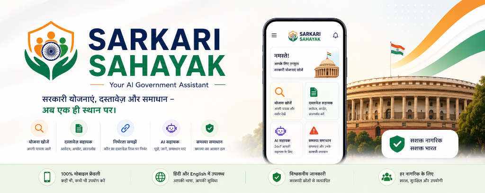

# Sarkari Sahayak - Your AI Government Assistant (आपका स्मार्ट सरकारी सहायक)



Sarkari Sahayak is a mobile-first, high-fidelity, performance-optimized AI Government Assistance Platform built for the **Build For Good 2026 Hackathon**. 

It is designed to empower Indian citizens to seamlessly discover government schemes, calculate dynamic eligibility scores, understand document dependency chains, resolve application errors, and interact with a bilingual conversational agent—all in simple, accessible Hindi (Devanagari) combined with English.

---

## 🌟 Key Features

1. **Smart Scheme Finder (स्मार्ट योजना खोजक):** Check demographic eligibility in real-time based on state, age, gender, caste category, occupation, income, and physical disabilities.
2. **Rebranded Dashboard:** Renamed to **Sarkari Sahayak** with a modern patriotic tricolor theme, premium backdrop blurs, and Parliament-inspired aesthetic overlays.
3. **State Scheme Filter (राज्य फ़िल्टर):** Intelligently overlays central government schemes with the citizen's specific state (e.g. Madhya Pradesh, Gujarat) while filtering out irrelevant regional schemes.
4. **Document Sahayak (दस्तावेज़ सहायक):** High-fidelity workflows guiding citizens through applying (`new`), updating (`update`), fixing (`correction`), downloading (`download`), or checking the status of essential certificates (Aadhaar, PAN, Voter ID, Domicile, etc.).
5. **Document Dependency Engine (दस्तावेज़ निर्भरता):** Automatically displays which underlying documents are required to obtain or update another document, preventing repeated trips to government centers.
6. **Smart Eligibility Booster (पात्रता बूस्टर):** Scans the citizen's current profile documents and calculates which high-value schemes they can unlock next simply by obtaining missing documents.
7. **Missing Document Detector (लापता दस्तावेज़ पहचान):** Evaluates every scheme's requirements against the citizen's possessed documents, highlighting missing files with direct links to Document Sahayak.
8. **Problem Solver (समस्या समाधान):** Troubleshooting wizard providing official step-by-step resolution timelines for common issues (e.g., mismatched names on Aadhaar, lost cards).
9. **AI Government Assistant (एआई सहायक):** Dynamic chat interface styled in deep purple glassmorphism, complete with voice-dictation simulation, live eligibility reporting chip, and bilingual suggestion cards.

---

## 📂 Folder Structure

```
sarkarsaathi/
│
├── index.html          # Homepage (Grand Hero with Sansad Bhavan backdrop)
├── schemes.html        # Scheme Finder Page (Sidebar filters & details modal)
├── documents.html      # Document Sahayak Page (Dynamic workflows)
├── problems.html       # Problem Solver Page (Troubleshooting timeline)
├── assistant.html      # AI Assistant Page (Bilingual chat interface)
├── result.html         # Smart Eligibility Results Page (Tricolor score progress bar)
│
├── css/
│   ├── variables.css   # Color tokens, spacing, and system variables
│   ├── common.css      # Header, Footer, Bottom Nav, Buttons, Cards
│   ├── schemes.css     # Scheme filter inputs, card details
│   ├── documents.css   # Document workflow stages
│   ├── assistant.css   # Chat bubble layouts
│   ├── problem.css     # Error warnings and resolutions
│   └── responsive.css  # Mobile and desktop viewport adjustments
│
├── js/
│   ├── app.js          # Shared navbar, drawer, theme toggles, profile loader
│   ├── data-loader.js  # Async JSON fetchers & O(1) hash maps caching
│   ├── search.js       # Global text search & O(1) set-based stop-words filter
│   ├── filter.js       # Dynamic eligibility matching & dependency engine
│   ├── schemes.js      # Schemes list controller & Tailwind modal
│   ├── documents.js    # Document Sahayak controller
│   ├── assistant.js    # AI Assistant simulator & Live eligibility responder
│   └── problems.js     # Problem Solver controller
│
├── data/
│   ├── schemes.json    # Scheme profiles database (PMJDY, PMUY, Ladli Behna, etc.)
│   ├── documents.json  # Document workflows & dependencies JSON
│   ├── problems.json   # Troubleshooting guidance database
│   └── rules.json      # Options (states, categories) and home FAQs
│
└── README.md           # Documentation
```

---

## 🛠️ Technology Stack & Optimizations

* **Frontend Framework:** Clean, semantic HTML5 structured pages.
* **Styling System:** **Tailwind CSS v3 (CDN-injected)** + custom theme presets (Saffron, Navy, Green, Emerald, Slat) with CSS Variable fallbacks for maximum design control.
* **Interactive Engine:** Modern Vanilla JavaScript (ES6 modules).
* **Performance Enhancements:**
  * **O(1) Hash Map Conversions:** Removed linear array lookups (`.find()` / `.filter()`) inside `DataLoader` and replaced them with pre-indexed key mapping objects.
  * **O(1) Search Filter Set:** Optimized text search by swapping stop-word arrays with an ES6 Set-based lookup.
  * **Short-circuit Iteration:** Replaced redundant nested `.map().includes()` arrays inside `Filter` loops with immediate short-circuiting `.some()` evaluations to minimize CPU usage.
* **Data Layer:** Scalable local JSON schemas mimicking server databases.
